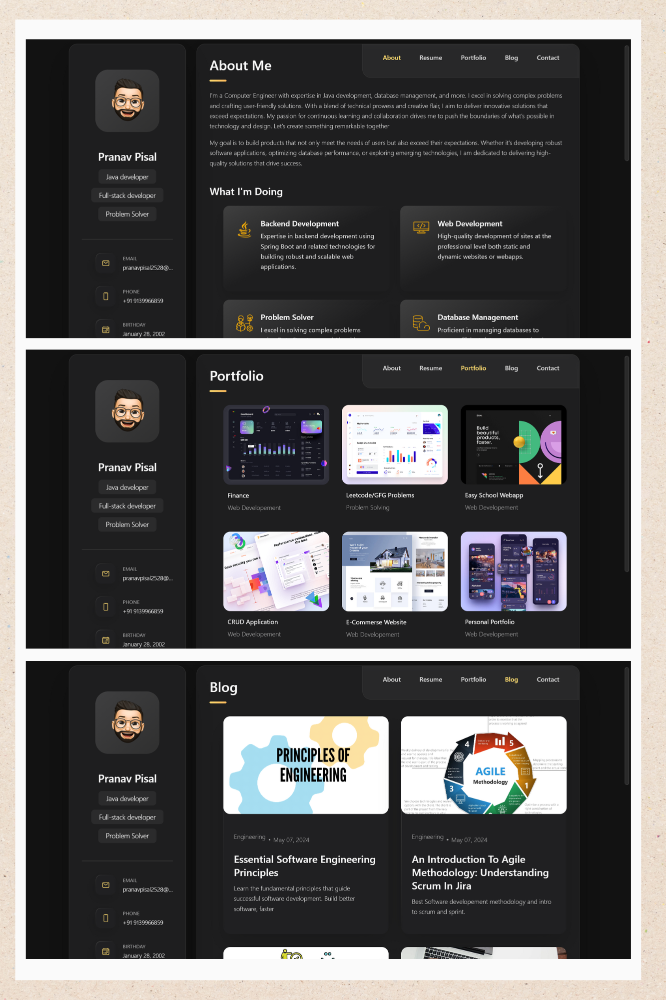
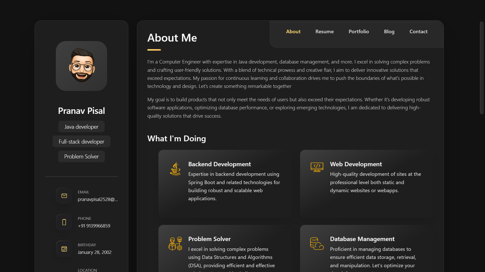
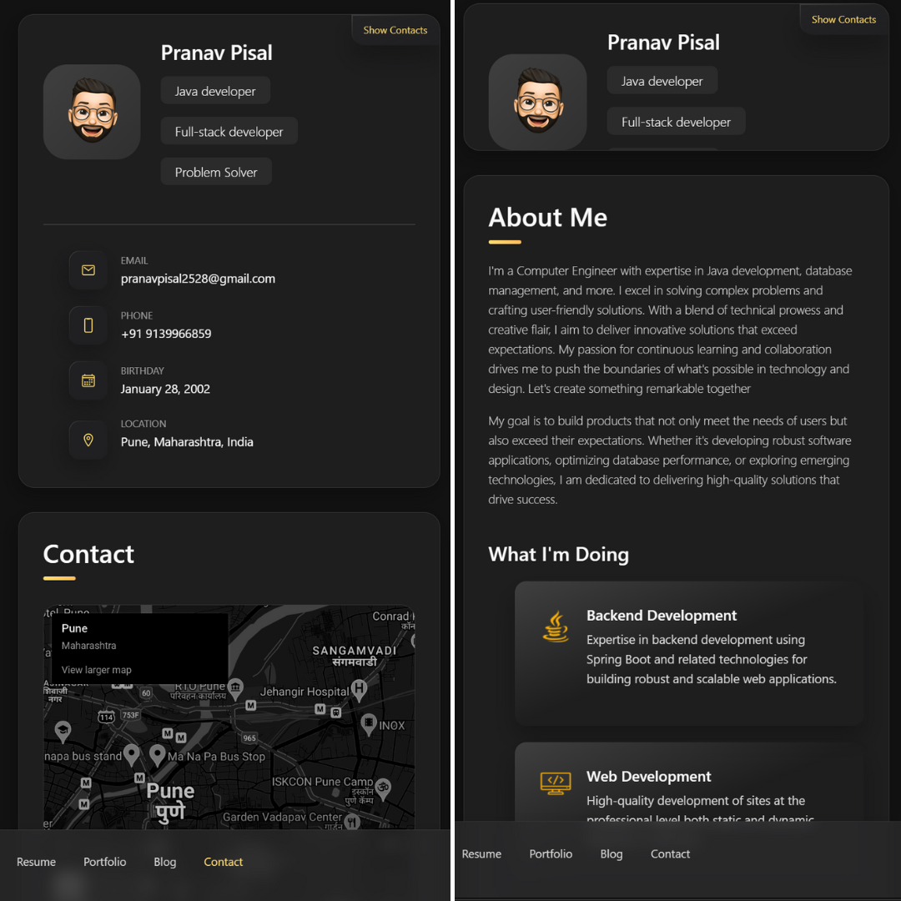

# Pranav's Portfolio Website

🌟 [Explore My Portfolio Website (click here)](https://pranav128.github.io/pranav_pisal_portfolio.github.io/) 🌟


- Desktop Demo

- Mobile Demo


## Introduction

Welcome to my personal portfolio website! This website showcases my projects, skills, and experience in IT field. This is my fully responsive personal portfolio website, responsive for all devices, built using HTML, CSS, and JavaScript. Whether you're a recruiter, potential employer, or just curious about my work, feel free to explore!


## Prerequisites

Before you begin, ensure you have met the following requirements:

* [Git](https://git-scm.com/downloads "Download Git") must be installed on your operating system.

* Any IDE and web-browser must be installed on your operating system.

## Features

- **Project Showcase:** Browse through my latest projects with descriptions and links to their respective repositories or live demos.
- **Skills:** Get an overview of the technologies and tools I specialize in.
- **About Me:** Learn more about my background, interests, and professional experiences.
- **Contact:** Reach out to me easily through the contact form or my social media profiles.

## Technologies Used

- **Frontend:** HTML5, CSS3, JavaScript
- **Version Control:** Git, GitHub

## Cloning website

To view the **personal-portfolio** locally, follow these steps:

Linux and macOS:

```bash
sudo git clone https://github.com/Pranav128/pranav_pisal_portfolio.github.io.git
```

Windows:

```bash
git clone https://github.com/Pranav128/pranav_pisal_portfolio.github.io.git
```

- Open `index.html` in your web browser.

## Contributing

If you find any issues or have suggestions for improvements, feel free to open an issue or submit a pull request. Contributions are welcome!


## License

This project is licensed under the [MIT License](LICENSE).

## Contact

- **Email:** [pranavpisal2528@gmail.com](mailto:pranavpisal2528@gmail.com)
- **LinkedIn:** [Pranav_Pisal](https://www.linkedin.com/in/pranav-pisal-06a4271b7/)
- **Instagram:** [_pranav_p.exe](https://www.instagram.com/_pranav_p.exe/)